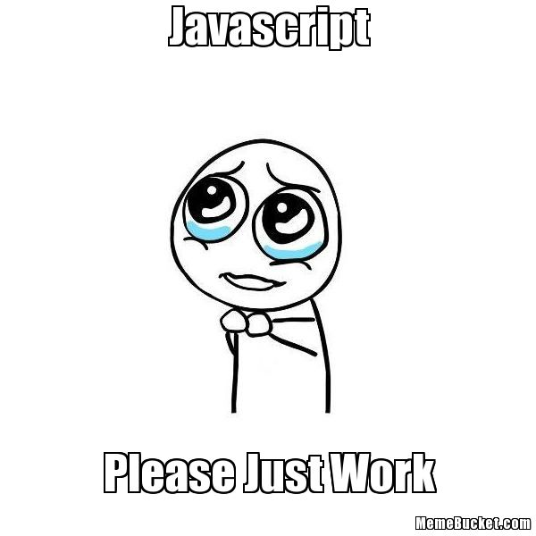

# JavaScript - Warm up

JavaScript is used for many things. Here, we will use JavaScript for Scripting for learning all basic concepts of this language to  complete the given tasks

## Concepts you need to know to do these tasks
How to run a JavaScript script
How to create variables and constants
What are differences between var, const and let
What are all the data types available in JavaScript
How to use the if, if ... else statements
How to use comments
How to affect values to variables
How to use while and for loops
How to use break and continue statements
What is a function and how do you use functions
What does a function that does not use any return statement return
Scope of variables
What are the arithmetic operators and how to use them
How to manipulate dictionary
How to import a file

## Requirements
You need to be an alx student to access the resources and questions to these tasks
